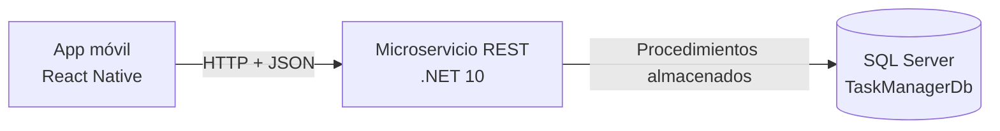
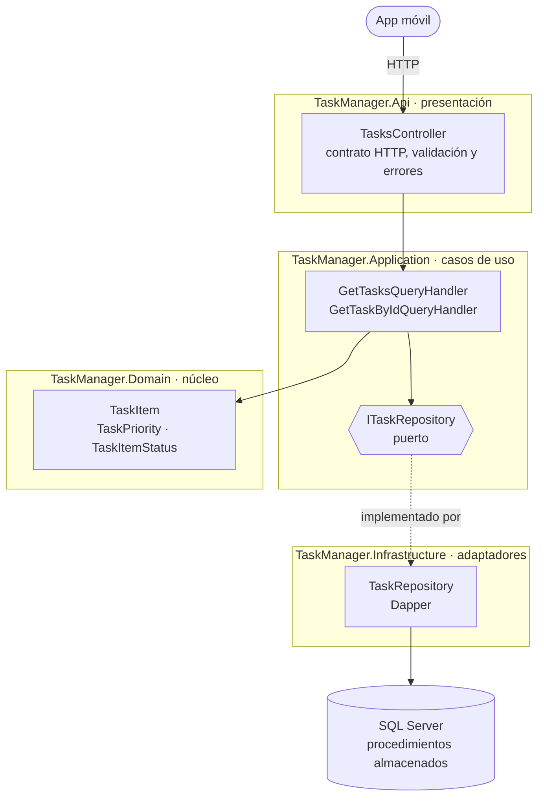
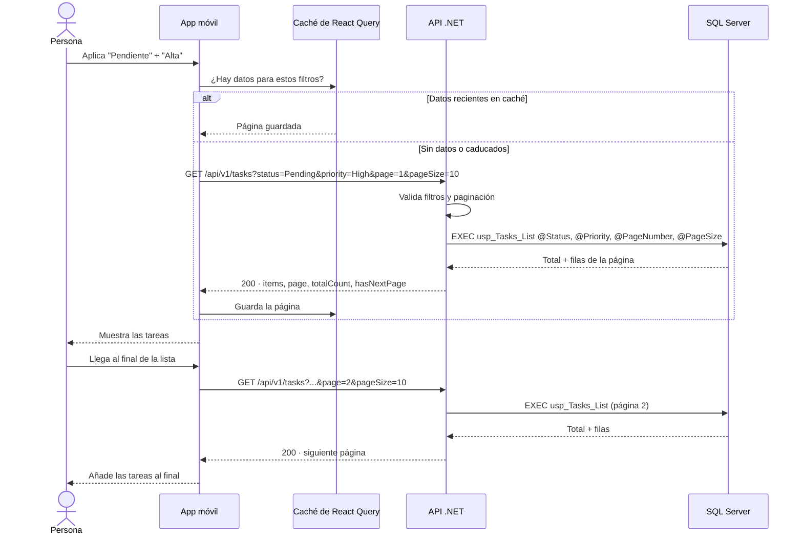
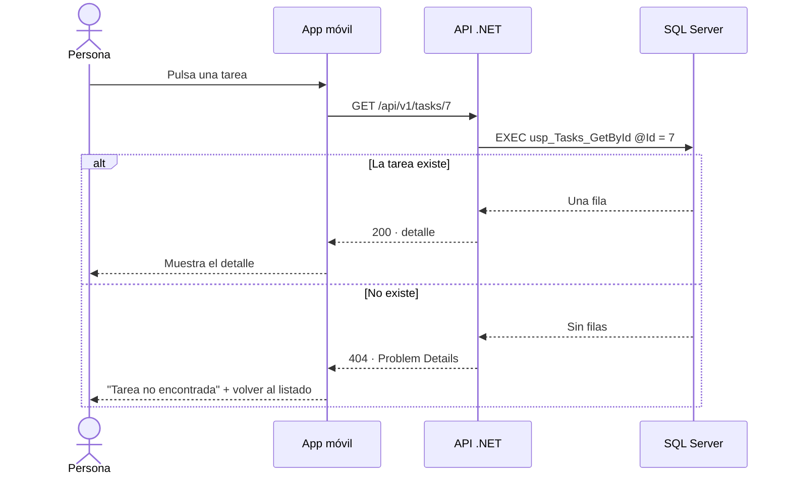
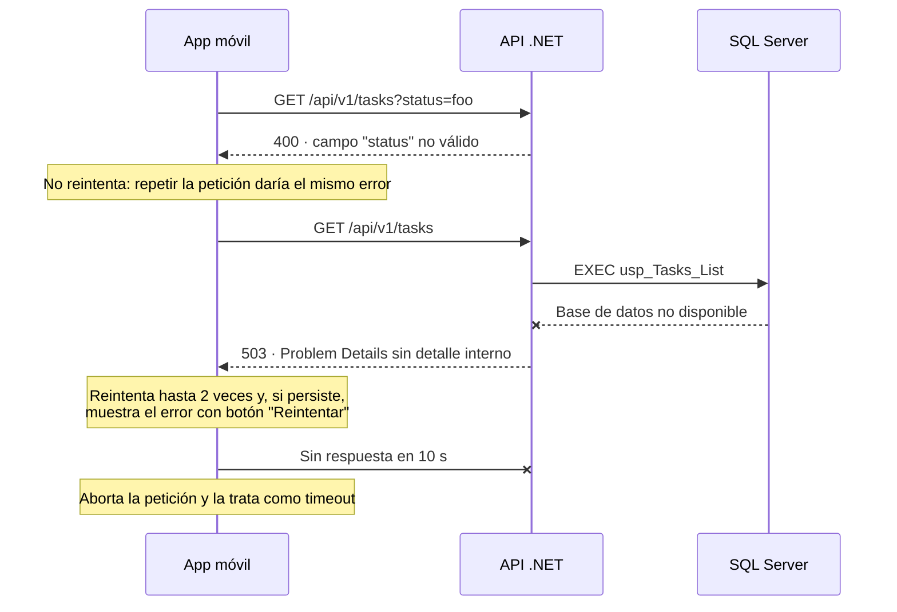
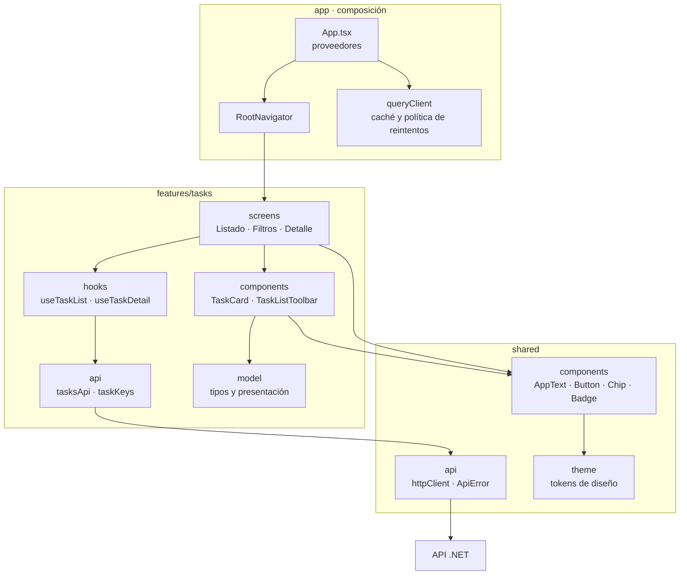
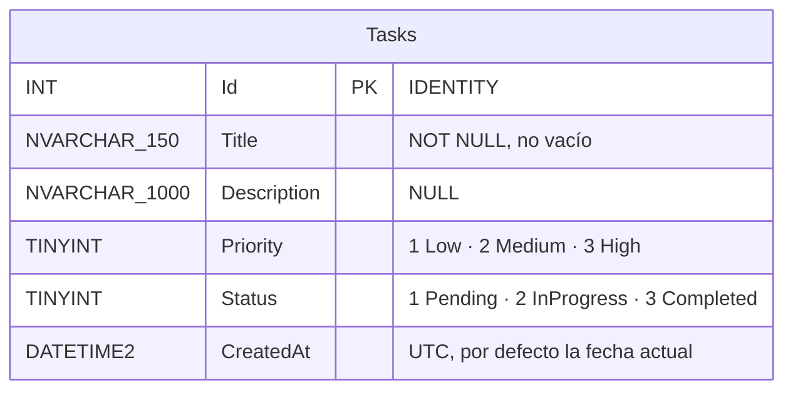

# Arquitectura

Este documento describe cómo está construida la solución. El porqué de cada
elección está en [decisiones.md](decisiones.md).

- [Vista general](#vista-general)
- [Arquitectura del backend](#arquitectura-del-backend)
- [Comunicación app ↔ API ↔ base de datos](#comunicación-app--api--base-de-datos)
- [Arquitectura de la app móvil](#arquitectura-de-la-app-móvil)
- [Modelo de datos](#modelo-de-datos)

## Vista general

Tres piezas con una responsabilidad cada una:

| Pieza | Responsabilidad | No hace |
| ----- | --------------- | ------- |
| App móvil | Presentar las tareas y recoger los filtros | No conoce la base de datos ni filtra en memoria |
| API | Validar la petición, orquestar el caso de uso y definir el contrato | No contiene SQL fuera de la capa de infraestructura |
| Base de datos | Guardar las tareas, filtrar y paginar | No conoce HTTP ni el formato de la respuesta |

## Arquitectura del backend

El backend sigue Clean Architecture en cuatro proyectos. La regla es una
sola: **las dependencias apuntan hacia adentro**. El dominio no depende de
nadie; la aplicación solo del dominio; la API y la infraestructura dependen
de la aplicación.

Las flechas continuas muestran quién llama a quién al atender una petición. La
flecha punteada es la clave del diseño: en tiempo de ejecución el caso de uso
acaba llamando al repositorio, pero en el código la dependencia va al revés.
`Application` define la interfaz y no sabe que existe `Infrastructure`; es
`Infrastructure` quien referencia a `Application` para implementarla.

### Qué vive en cada capa

| Proyecto | Contiene | Depende de |
| -------- | -------- | ---------- |
| `TaskManager.Domain` | La entidad `TaskItem`, que valida sus invariantes al construirse, y los enums de prioridad y estado | Nada |
| `TaskManager.Application` | Un caso de uso por consulta, los DTOs de salida, las reglas de paginación y el puerto `ITaskRepository` | Domain |
| `TaskManager.Infrastructure` | La implementación del puerto con Dapper sobre los procedimientos almacenados, la fábrica de conexiones y la comprobación de salud | Application |
| `TaskManager.Api` | El controlador, el contrato HTTP, la serialización y el manejo global de errores | Application e Infrastructure |

La API referencia a la infraestructura únicamente para registrar sus servicios
en el arranque (`AddInfrastructure`). El controlador solo conoce los casos de
uso, y los tipos de infraestructura son `internal`, así que el compilador
impide usarlos desde otra capa.

### El puerto y su adaptador

`ITaskRepository` se define en la capa de aplicación, que es quien lo
necesita, y se implementa en infraestructura. Esa inversión es la que permite:

- Probar los casos de uso y el contrato HTTP sin base de datos, sustituyendo
  el repositorio por un doble.
- Cambiar el acceso a datos (otro motor, otro ORM, una caché delante) sin
  tocar los casos de uso ni la API.

## Comunicación app ↔ API ↔ base de datos

### Listado con filtros

### Detalle

### Qué pasa cuando algo falla

| Situación | Respuesta de la API | Qué hace la app |
| --------- | ------------------- | --------------- |
| Filtro o paginación no válidos | 400 con el campo afectado | No reintenta |
| La tarea no existe | 404 | Ofrece volver al listado |
| Base de datos caída | 503 | Reintenta y luego ofrece "Reintentar" |
| Error inesperado | 500 sin detalle interno | Reintenta y luego ofrece "Reintentar" |
| Sin conexión | — | "Sin conexión con el servidor" |
| El servidor no responde | — | Aborta a los 10 s |
| Falla al cargar más páginas | cualquiera de las anteriores | Conserva las tareas ya mostradas y ofrece reintentar al pie |

## Arquitectura de la app móvil

El código se organiza por *feature*. Las dependencias van en un solo
sentido: `app` → `features` → `shared`.

| Carpeta | Responsabilidad |
| ------- | --------------- |
| `app/` | Monta los proveedores y compone las rutas de las features. No tiene lógica de negocio. |
| `features/tasks/screens` | Deciden qué estado mostrar (carga, vacío, error, datos) y traducen gestos en navegación. |
| `features/tasks/hooks` | Único punto de acceso a los datos de tareas; encapsulan React Query. |
| `features/tasks/api` | Conocen las rutas y parámetros de la API de tareas. |
| `features/tasks/model` | Tipos del dominio y su traducción a textos y colores. |
| `shared/api` | Cliente HTTP y clasificación de errores, sin saber nada de tareas. |
| `shared/components` y `shared/theme` | Componentes base y tokens con los que se construye toda la interfaz. |

Una pantalla nunca llama a `fetch` ni conoce una URL: pide datos a un hook.
Eso permite probar las pantallas sustituyendo solo `tasksApi`.

## Modelo de datos

| Objeto | Propósito |
| ------ | --------- |
| `CK_Tasks_Priority`, `CK_Tasks_Status` | Impiden valores fuera del dominio |
| `CK_Tasks_Title_NotBlank` | Impide títulos vacíos o solo con espacios |
| `IX_Tasks_Status_Priority` | Filtro por estado, o por estado y prioridad |
| `IX_Tasks_Priority` | Filtro solo por prioridad |
| `usp_Tasks_List` | Listado con filtros opcionales y paginación en servidor |
| `usp_Tasks_GetById` | Detalle de una tarea |

La columna `CreatedAt` no forma parte del modelo pedido en el enunciado. Se
añadió porque un listado paginado necesita un orden estable: sin él, la misma
tarea podría aparecer en dos páginas o en ninguna.
